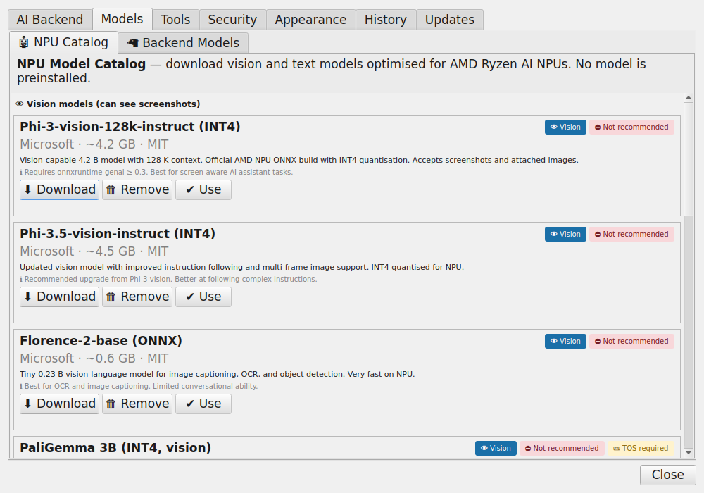

# AI Model Guide

This guide explains how to **add**, **select**, and **delete** AI models through
the Linux AI NPU Helper GUI — including browsing for ONNX files and dragging
models in from your file manager.

---

## Overview

The application supports three kinds of AI model sources:

| Source | How to add | Best for |
|--------|-----------|----------|
| **Ollama** (local server) | Pull via `ollama pull <name>` or the Models tab | Most LLMs (Llama, Mistral, Gemma…) |
| **OpenAI-compatible server** | Set in the Backend tab (LM Studio, Jan, etc.) | Any GGUF model served locally |
| **ONNX file** | Browse or drag-and-drop in the Models tab | AMD NPU inference |

---

## Opening the Settings / Model Manager

1. Press the **Copilot key** (or `Ctrl+Alt+Space`) to open the assistant.
2. Click the **⚙ Settings** button in the top-right corner.
3. Select the **Models** tab.

<!-- Image missing:  -->

---

## Selecting a model from your Ollama server

1. Make sure Ollama is running: `ollama serve`
2. Open **Settings → Models tab**.
3. Click **🔄 Refresh** to fetch the list of installed models.
4. Click a model name in the list to select it.
5. The **NPU compatibility badge** next to each model tells you whether it
   will run well on the NPU:

    | Badge | Meaning |
    |-------|---------|
    | ✅ **NPU OK** | Small/quantized model — should run efficiently on NPU |
    | ⚠ **NPU Warning** | May run slowly or fall back to CPU |
    | ⛔ **Not recommended** | Too large or incompatible format for NPU |

6. Click **✔ Use this model** to activate it.  The change is saved
   automatically to `~/.config/linux-ai-npu-helper/settings.json`.

---

## Browsing for an ONNX file

If you have downloaded a model in ONNX format for direct NPU inference:

1. Open **Settings → Models tab**.
2. Click **📂 Browse ONNX…**
3. A file-picker dialog opens filtered to `*.onnx` files.
4. Navigate to your model file and click **Open**.
5. The path is added to the model list and selected automatically.
6. Click **✔ Use this model** to activate it.

!!! tip "Where to get ONNX models"
    - [Hugging Face](https://huggingface.co/models?library=onnx) — search for `onnx` models
    - [ONNX Model Zoo](https://github.com/onnx/models)
    - Export your own with [Optimum](https://huggingface.co/docs/optimum/index):
      ```bash
      pip install optimum[exporters]
      optimum-cli export onnx --model meta-llama/Llama-3.2-1B onnx-llama3/
      ```

---

## Drag-and-drop

You can drag a model file directly from your file manager into the Models tab:

1. Open **Settings → Models tab**.
2. Open your file manager (Nautilus, Dolphin, Thunar, etc.) and navigate to your model.
3. Drag the `.onnx` or `.gguf` file and drop it onto the **model list area** in the Settings window.
4. The file path appears in the list and is selected automatically.
5. Click **✔ Use this model** to activate it.

!!! note "Supported drag-and-drop formats"
    - `.onnx` — direct NPU inference via ONNX Runtime
    - `.gguf` — served via Ollama or llama.cpp (the path is registered as the model name)

---

## Deleting a model

### Ollama models

1. Select the model in the list.
2. Click **🗑 Delete**.
3. A confirmation dialog appears. Click **Yes** to remove the model.

This runs `ollama rm <model-name>` under the hood. The model files are
permanently removed from your Ollama store (`~/.ollama/models/`).

### ONNX files

1. Select the ONNX file entry in the list.
2. Click **🗑 Delete**.
3. Choose whether to:
   - **Remove from list only** — the file stays on disk but is removed from the settings.
   - **Delete file from disk** — permanently deletes the `.onnx` file.

!!! warning
    Deleting a file from disk is irreversible. Make sure you have a backup
    before choosing this option.

---

## NPU compatibility details

The NPU compatibility check evaluates each model against these rules:

| Rule | Result |
|------|--------|
| File ends in `.onnx` | ✅ OK — designed for ONNX Runtime / NPU |
| Model name contains `70b`, `65b`, `34b`, etc. | ⛔ Too large for NPU memory |
| Vision model (llava, bakllava, moondream…) | ⚠ Needs custom ONNX export |
| Full-precision (`f16`, `f32`, `bf16`) | ⚠ Slow on NPU; use quantized variant |
| Quantized small model (`3b-q4_K_M`, etc.) | ✅ OK |
| Embedding model (nomic-embed, mxbai-embed…) | ⚠ Not for conversational use |
| Model > 13 GB | ⚠ May exceed NPU memory |

These thresholds can be adjusted in `settings.json` under `model_selector.size_warning_gb`.

---

## Recommended models for NPU

These models are known to work well on AMD Ryzen AI NPUs:

| Model | Size | Quantization | Notes |
|-------|------|-------------|-------|
| `llama3.2:3b-instruct-q4_K_M` | ~2 GB | Q4_K_M | Fast, great for Q&A |
| `phi3:mini-instruct-q4_K_M` | ~2.3 GB | Q4_K_M | Microsoft, code-capable |
| `mistral:7b-instruct-q4_K_M` | ~4.1 GB | Q4_K_M | Good all-rounder |
| `gemma2:2b-instruct-q4_K_M` | ~1.6 GB | Q4_K_M | Tiny, very fast |
| `qwen2.5:3b-instruct-q4_K_M` | ~2 GB | Q4_K_M | Multilingual |

Pull any of these with:

```bash
ollama pull llama3.2:3b-instruct-q4_K_M
```
